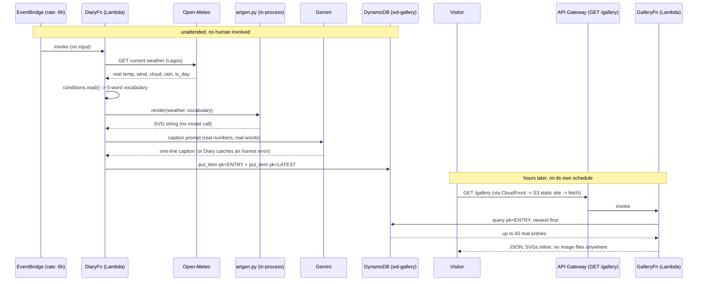

# Architecture

One CDK stack (`wd-dev`), not three — see `infra/lib/weather-diary-stack.ts`
for the reasoning. A CloudFront-proxied, IAM-authed Lambda Function URL was
the original plan for the read route (no API Gateway, no CORS surface at
all); it hit a real, unresolved `AccessDeniedException` between CloudFront's
Origin Access Control and Lambda Function URLs despite a textbook-correct
config on both sides, documented in `BUILD_LOG.md` step 8. The read route
is a one-resource API Gateway REST API instead — the same building block
already proven reliable in this series' other two entries.

## Why this shape

- **One stack.** The app has exactly one table, one scheduled writer, one
  public reader, one static site. Three stacks (data/api/hosting) would
  only exist to hand exports between each other for no functional reason
  at this size.
- **No S3 image bucket.** Each picture is a few KB of SVG markup, stored
  inline as a DynamoDB attribute and injected straight into the DOM. A
  bucket, an Origin Access Control, and presigned URLs would all exist to
  solve a storage problem this app doesn't have.
- **No foundation model for the art.** See `artgen.py`'s docstring: Amazon
  Bedrock hit a real account-level throttle, confirmed across two models,
  so the picture is built by code reading `conditions.py`'s five-word
  vocabulary directly. Gemini still writes the caption — that call has
  never been throttled.
- **API Gateway, after all.** Tried to remove it too (see step 8 in
  `BUILD_LOG.md`); the attempt failed for reasons outside this app's
  control, not because the idea was wrong.

## AWS services in play

Lambda (write path + read path), EventBridge (the schedule), DynamoDB (the
one table), API Gateway (the one route), Secrets Manager (the Gemini key),
S3 + CloudFront (the static frontend only — no data lives in S3 here).
